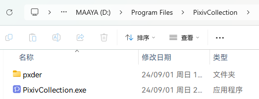

<h1 align="center"> ${{\color{#0398fa}Pixiv}Collection{\color{#39c5bb}.exe}}$ </h1>
<p align="center">⭐ Pixiv 本地收藏夹管理: 爬取、下载、转换 ⭐</p>


## 简介

[示例站点](https://pxc.cocomi.eu.org/)

将个人的 Pixiv 收藏夹数据爬取到本地，图片压缩为 webp 格式，动图(ugoira)转为 mp4 格式

无后端设计，图片数据一次性全部加载，图片较多时可能需要较长的时间

## 下载

https://github.com/asadahimeka/PixivCollection/releases

## 功能

- 图片爬取
  - 内置 [pxder](https://github.com/Tsuk1ko/pxder)
  - 设置好 RefreshToken 后一键爬取收藏夹作品并存储 JSON 数据到本地
- 图片压缩
  - 使用 [sharp](https://sharp.pixelplumbing.com/) 将原图压缩为 webp 格式，提升加载速度
- 动图转换
  - 使用 [ffmpeg](https://www.ffmpeg.org/) 将动图(ugoira)转换为 mp4 格式，方便查看
- 图片浏览
  - 瀑布流布局，可自定义瀑布流列数与间隔
  - 简易的图片浏览器，支持PC端和移动端的图片缩放与拖动
- 图片筛选
  - 通过发布年份、形状、尺寸、不健全度、R18、作者、标签、收藏数筛选图片
- 图片搜索
  - 通过图片id、图片标题、作者id、作者昵称、标签、标签翻译搜索图片
- 夜间模式
- 全屏模式

## 开发

> [!NOTE]
> 构建前端需要安装 Node.js >= 20.16.0 环境及 yarn v1 包管理器
> 构建应用需要 Windows 开发环境以及 rust 开发环境，参见 [Tauri 文档](https://tauri.app/v1/guides/getting-started/prerequisites)

为了方便使用，应用内置了 Node.js 与 ffmpeg，开发和部署时需手动将 `ffmpeg.exe` 和 `node.exe` 放置于 `/pxder` 内

- ffmpeg version 7.0.2
- Node.js version 20.16.0

```bash
# 安装依赖
yarn install

# 启动服务
yarn dev
```

## 部署

```bash
# 安装依赖
yarn install

# 构建应用
yarn build:win
```

构建后的前端文件位于 `scripts\PixivCollection` 目录，可将该目录以压缩包格式上传至应用分发服务器

目录结构如下



## Credits

- [PixivCollection](https://github.com/orilights/PixivCollection)：原项目，修改于此
- [pxder](https://github.com/Tsuk1ko/pxder)：pixiv 图片爬取工具

## Disclaimer

本项目与 pixiv.net(ピクシブ株式会社) 无任何隶属关系。

本项目网站、APP 所展示的所有作品的版权均为 Pixiv 或其原作者所有。

本项目仅供交流与学习，不得用于任何商业用途。

## License

Licensed under the [MIT](https://github.com/asadahimeka/PixivCollection/blob/tauri/LICENSE) license

Copyright © 2024 Yumine Sakura

<p></p>
